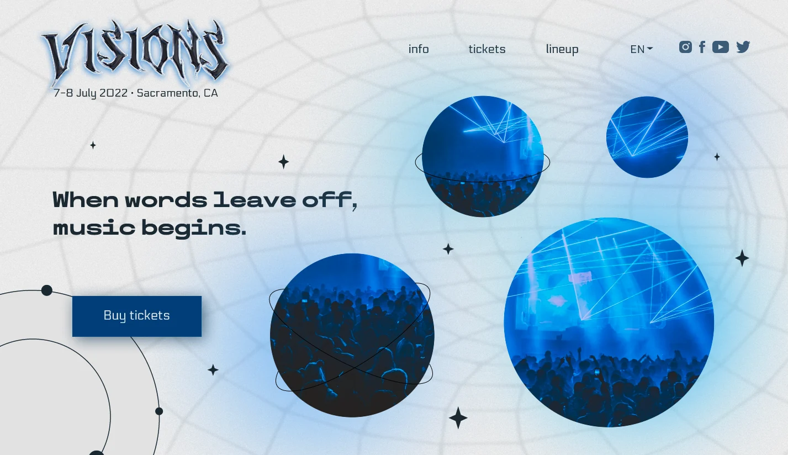

# Visions Website

This is my 14th project which is a website for the 'Visions' music festival.

(The design is by Nastya Ost)

## Screenshot



## Get started

Install all modules and their dependencies that are listed on package.json file:

```bash
npm install
```

Watch the SCSS files and compile the CSS file:

```bash
npm run compile:sass
```

## Built with

- HTML
- CSS(SASS)
